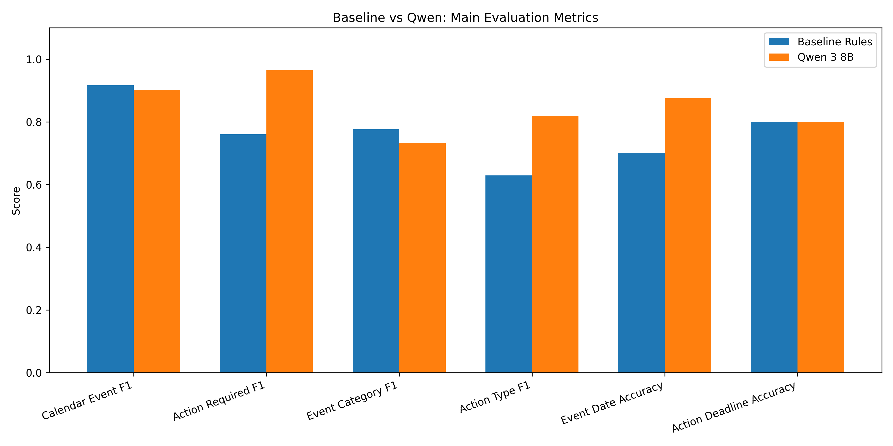
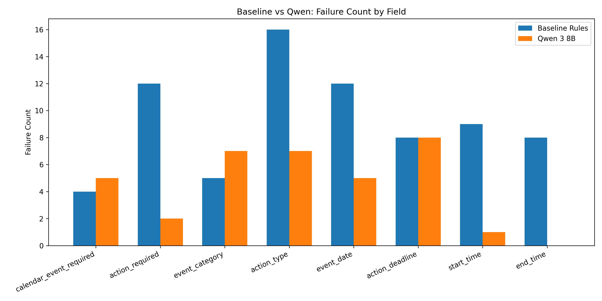
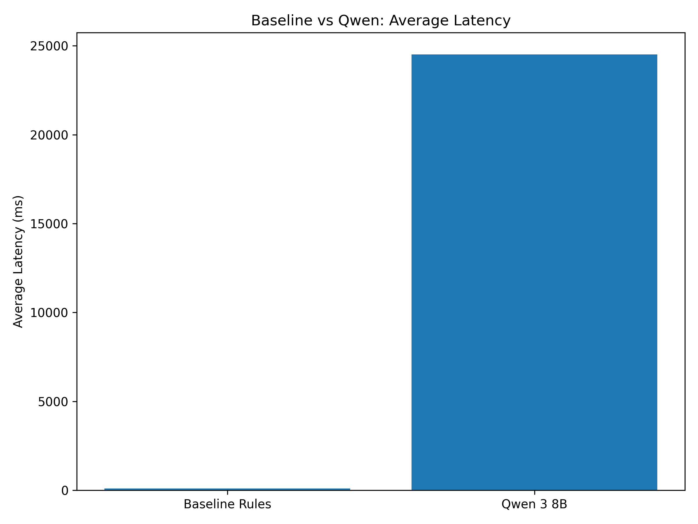

# Email Calendar Evaluation Pipeline


**Rules vs. LLM — who extracts calendar events from messy emails better?**

A Python pipeline for benchmarking how well different extraction methods turn raw email-style messages into structured calendar events and action items. Compares a rule-based baseline against a local LLM (Qwen 3 8B via Ollama) across precision, recall, F1, field-level accuracy, latency, and failure patterns.

## The Problem

Assistant-style products need to pull actionable structure out of messy text — calendar events, reminders, deadlines, action items. That gets hard fast when messages contain multiple dates, relative time expressions, cancellations, ambiguous phrasing, and inconsistent formatting.

This project builds a repeatable evaluation pipeline around that problem rather than just running a single model and eyeballing the output.

```
┌─────────────┐     ┌──────────────────┐     ┌────────────────┐     ┌──────────────┐
│  Raw Email   │ ──▶ │  Rule-Based      │ ──▶ │  Evaluate &    │ ──▶ │  Compare &   │
│  Messages    │     │  + LLM Extractor │     │  Score Fields  │     │  Visualise   │
└─────────────┘     └──────────────────┘     └────────────────┘     └──────────────┘
```

## What It Does

Takes an email-style message and extracts:

- Whether a calendar event should be created
- Event category, date, start/end time
- Whether an action is required
- Action type and deadline
- A short summary

Two extraction methods are benchmarked side-by-side against a 40-row labelled benchmark (20 synthetic + 20 Enron-derived).

## Results at a Glance

| Metric | Rule-Based Baseline | Qwen 3 8B |
|---|---|---|
| Avg latency | 95 ms | 24,516 ms |
| Calendar event F1 | 0.917 | 0.902 |
| Action required F1 | 0.760 | 0.964 |
| Event category macro F1 | 0.776 | 0.733 |
| Action type macro F1 | 0.629 | 0.819 |
| Event date accuracy | 0.700 | 0.875 |
| Action deadline accuracy | 0.800 | 0.800 |

No clear winner — each method has different strengths. The baseline is fast and solid on straightforward classification. The LLM handles nuanced action interpretation and temporal extraction better. Both still struggle with action deadlines and ambiguous event categories.

> **Bottom line:** The strongest practical outcome is a **hybrid approach** — let rules handle the easy stuff fast, route the harder cases to an LLM. Best of both worlds.





## Dataset

### Benchmark composition

The final evaluation set has **40 labelled rows**:

- **20 synthetic** — trip reminders, parent meetings, club updates, payment deadlines, cancellations, general reminders
- **20 Enron-derived** — real corporate email language with messier formatting and less predictable structure

### Enron data pipeline

The real-world subset was built through a multi-stage pipeline:

```
1,000 raw emails  →  -32 dupes  →  778 clean  →  120 candidates  →  20 labelled
```

Raw Enron maildir is not committed (too large). The repo includes the cleaned artefacts, labelled data, and all outputs.

## Extraction Schema

**Event categories:** `none`, `meeting_admin`, `club_activity`, `trip`, `payment_deadline`, `cancellation_change`, `reminder_other`

**Action types:** `none`, `attend`, `pay`, `reply_confirm`, `bring_item`, `submit_form`

Full output fields: `calendar_event_required`, `event_category`, `event_date`, `start_time`, `end_time`, `action_required`, `action_type`, `action_deadline`, `summary`

## Methods

### Rule-based baseline

Keyword matching, regex, date parsing, and priority rules. Fast, interpretable, easy to debug. Falls over when wording is indirect or when multiple temporal cues compete.

### Qwen 3 8B (Ollama)

Local LLM with structured JSON output, fixed schema, and deterministic prompting (`temperature=0`). Better at reading between the lines on action intent and date/time extraction. The trade-off? **~250x slower** (95 ms vs 24.5 seconds per message).

## Evaluation Approach

**Classification fields** (`calendar_event_required`, `action_required`, `event_category`, `action_type`) — precision, recall, F1, macro F1.

**Extraction fields** (`event_date`, `start_time`, `end_time`, `action_deadline`) — exact match accuracy.

**Operational** — average latency (ms).

**Error analysis** — field-level failure counts per method.

## Quickstart

### Requirements

- Python 3.14
- [Ollama](https://ollama.com/) installed with Qwen 3 8B pulled locally (for LLM evaluation only)

### Install

```bash
pip install -r requirements.txt
```

### Run the pipeline

```bash
# 1. Validate and split the dataset
python src/build_dataset.py

# 2. Run the rule-based baseline
python src/baseline_extractor.py

# 3. Evaluate baseline
python src/evaluate_predictions.py
python src/analyse_failures.py

# 4. Run the LLM extractor (requires Ollama + Qwen 3 8B)
python src/llm_extractor.py

# 5. Evaluate LLM output
#    Update file paths in evaluate_predictions.py and analyse_failures.py
#    to point to the Qwen output, then:
python src/evaluate_predictions.py
python src/analyse_failures.py

# 6. Generate comparison charts
python src/generate_visualisations.py
```

> **Note:** Steps 3 and 5 require you to update the input file paths in the evaluation scripts depending on which extractor output you're evaluating. This is documented in the script comments.

### Rebuild the Enron data stages

```bash
python src/extract_enron_messages.py
python src/clean_real_world_data.py
python src/select_enron_eval_candidates.py
python src/build_enron_label_template.py
python src/append_enron_labels.py
```

## Repo Structure

```
email-calendar-evaluation-pipeline/
├── data/
│   ├── raw/                          # Enron maildir (local only, not committed)
│   ├── intermediate/
│   │   ├── enron_messages_raw.csv
│   │   ├── enron_messages_clean.csv
│   │   └── enron_eval_candidates.csv
│   └── processed/
│       ├── eval_dataset.csv
│       ├── dev_dataset.csv
│       ├── test_dataset.csv
│       ├── enron_label_template.csv
│       └── enron_label_template_labeled.csv
├── docs/
│   └── label_guide.md
├── outputs/
│   ├── baseline_predictions.csv
│   ├── qwen_predictions.csv
│   ├── summary_metrics.csv
│   ├── field_metrics.csv
│   ├── failure_summary.csv
│   ├── qwen_summary_metrics.csv
│   ├── qwen_field_metrics.csv
│   ├── qwen_failure_summary.csv
│   └── charts/
│       ├── metric_comparison.png
│       ├── failure_comparison.png
│       └── latency_comparison.png
├── src/
│   ├── build_dataset.py
│   ├── baseline_extractor.py
│   ├── llm_extractor.py
│   ├── evaluate_predictions.py
│   ├── analyse_failures.py
│   ├── extract_enron_messages.py
│   ├── clean_real_world_data.py
│   ├── select_enron_eval_candidates.py
│   ├── build_enron_label_template.py
│   ├── append_enron_labels.py
│   ├── generate_visualisations.py
│   └── schemas.py
├── requirements.txt
└── README.md
```

## Implementation Notes

A few things that mattered more than expected in practice:

- Handling both clean benchmark timestamps and messy Enron-style timestamps required separate parsing paths
- Enron filenames with trailing dots caused issues on Windows
- Schema consistency across baseline and LLM outputs needed explicit enforcement
- Separating raw → intermediate → processed data stages kept things debuggable

## Known Limitations

- Single-message extraction only (no threading)
- One event and one action per message
- No attachment, image, or PDF processing
- No location or recurring event extraction
- 40-row benchmark — enough for directional findings, not production-grade statistical power
- Only one LLM model in the final comparison

## Possible Extensions

- Expand the labelled benchmark with more Enron rows
- Benchmark a second local model (Mistral, Llama, etc.)
- Build a hybrid router that sends easy cases to rules and hard cases to the LLM
- Improve action deadline handling (weakest field for both methods)
- Add confusion matrices and per-category breakdowns
- Introduce softer scoring for the summary field

## Built With

- **Python 3.14** — core pipeline
- **Qwen 3 8B** — local LLM via [Ollama](https://ollama.com/)
- **pandas** — data wrangling and evaluation
- **matplotlib** — visualisations
- **Enron Email Corpus** — real-world test data

## Author

**Shawn D'Souza** — [github.com/shawn-d123](https://github.com/shawn-d123)

## Licence

This project is licensed under the [MIT Licence](LICENCE).
